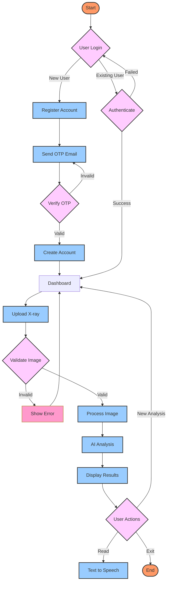

## 🔄 Process Flow

The X-ray Analysis Portal follows a structured workflow:

### 1. User Authentication

- **New Users**:
  - Register account
  - Verify email with OTP
  - Create account on verification
- **Existing Users**:
  - Direct login
  - Authentication check
  - Dashboard access

### 2. X-ray Analysis Process

- Upload X-ray image
- Validate format and size
- Process through AI model
- Generate detailed analysis

### 3. User Actions

- View analysis results
- Listen to text-to-speech
- Start new analysis
- Exit system

### 4. Error Handling

- Image validation checks
- Authentication verification
- Process monitoring
- Error recovery options

The system ensures a smooth user experience with comprehensive error handling and multiple output options.

---

Built with ❤️ in Timor-Leste 🇹🇱
