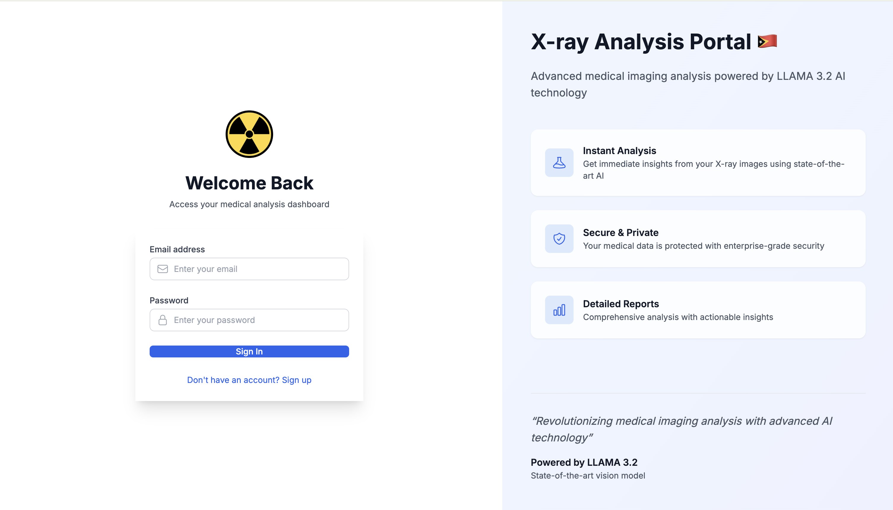
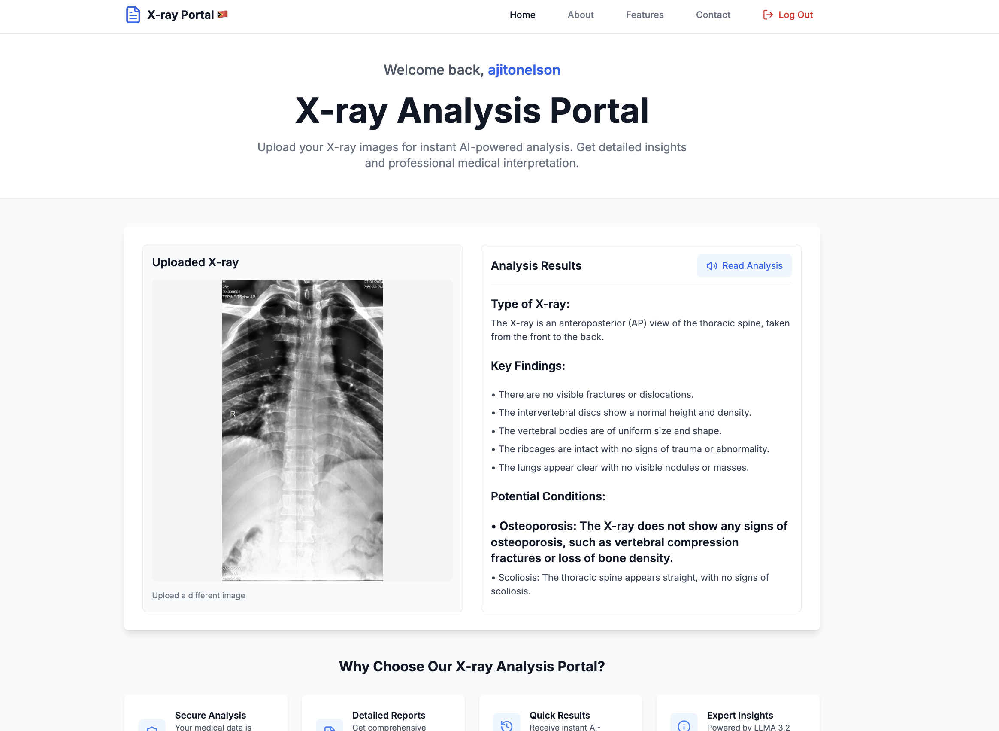

# X-ray Analysis Portal 🇹🇱

A modern web application for AI-powered X-ray image analysis using the LLAMA 3.2 Vision Model.

## 🎥 Video Demo

[](https://fb.watch/w0Qw3z13pk/)

[Click here to watch the demo on Facebook](https://fb.watch/w0Qw3z13pk/) <!-- Replace with your actual Facebook video link -->

[](https://www.personalxray.site)
[](https://nextjs.org/)
[](https://www.typescriptlang.org/)
[](https://together.ai/)
[](https://fb.watch/w0Qw3z13pk/)

## 🌟 Features

- **AI-Powered Analysis**: Utilizes LLAMA 3.2 Vision Model for accurate X-ray interpretation
- **Real-time Processing**: Instant analysis and detailed medical reports
- **Secure Authentication**: JWT-based auth system with email verification
- **Modern UI/UX**: Responsive design with Tailwind CSS and Tremor components
- **Text-to-Speech**: Built-in analysis reading capability for accessibility
- **Multi-format Support**: Handles various image formats (PNG, JPG, JPEG)

## 🛠️ Technology Stack

- **Frontend**: Next.js 14, TypeScript, Tailwind CSS, Tremor
- **Backend**: Next.js API Routes, MySQL
- **AI Model**: LLAMA 3.2 Vision Model via Together AI
- **Authentication**: JWT, bcrypt
- **Database**: TiDB Cloud
- **Email**: NodeMailer for OTP verification
- **Deployment**: Vercel

## 📋 Prerequisites

Before installation, ensure you have:

- Node.js 18+ installed
- MySQL/TiDB database access
- Together AI API key
- Email service credentials

## ⚙️ Installation

1. **Clone the repository**

```bash
git clone https://github.com/ajitonelsonn/personal-x-ray.git
cd personal-x-ray
```

2. **Install dependencies**

```bash
npm install
```

3. **Set up environment variables**
   Create a `.env.local` file:

```env
# Database Configuration
DB_HOST=gateway01.eu-central-1.prod.aws.tidbcloud.com
DB_PORT=4000
DB_USERNAME=your_username
DB_PASSWORD=your_password
DB_DATABASE=xray_portal

# Authentication
JWT_SECRET=your_jwt_secret

# Together AI
TOGETHER_API_KEY=your_api_key

# Email Configuration
EMAIL_USER=your_email
EMAIL_PASS=your_password
```

4. **Run database migrations**

```bash
mysql -u your_username -p < database_setup.sql
```

5. **Start the development server**

```bash
npm run dev
```

6. **Image for Test**
   If you don't have any image of an X-ray, you can use this:  
   [Test X-ray](https://github.com/ajitonelsonn/personal-x-ray/blob/main/FlowChart/testxray.jpeg)

## 🔄 Workflow

1. **User Authentication**

   - Register with email verification
   - Secure login with JWT
   - Password encryption using bcrypt

2. **X-ray Analysis**

   - Upload X-ray image
   - AI processing using LLAMA 3.2
   - Detailed analysis generation
   - Text-to-speech capability

3. **Results Presentation**
   - Structured analysis display
   - Key findings highlight
   - Potential conditions
   - Recommendations

## 🎯 Performance Optimizations

- **Image Processing**

  - Efficient image compression
  - Optimized file size limits
  - Caching implementation

- **Security Measures**
  - JWT token encryption
  - HTTP-only cookies
  - Rate limiting
  - XSS protection

## 📱 Screenshots

### Login Page



### Results View



## 🤝 Contributing

Contributions are welcome! Please feel free to submit a Pull Request.

## 📄 License

This project is licensed under the MIT License - see the [LICENSE](LICENSE) file for details.

## Learn More . . .

- **X-ray Analysis Portal - System Architecture Diagram**: [View here](https://github.com/ajitonelsonn/personal-x-ray/tree/main/System%20Architecture%20Diagram).
- **X-ray Analysis Portal - Flow Chart**: [View here](https://github.com/ajitonelsonn/personal-x-ray/tree/main/FlowChart).
- **X-ray Analysis Portal Database**: [View here](https://github.com/ajitonelsonn/personal-x-ray/tree/main/database_setup).

## 📞 Contact

For any queries or support, please contact:

- Facebook: [@ajitonelsonn](https://github.com/ajitonelsonn)
- Linkedin: [@ajitonelsonn](https://github.com/ajitonelsonn)

---

Built with ❤️ in Timor-Leste
