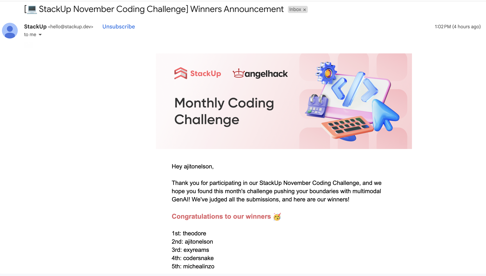
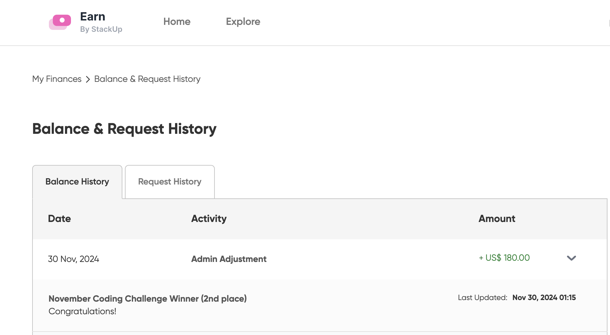

# 🥈 Runner-up of StackUp November Coding Challenge - Monthly Hackathon 2024
  <div align="center">
  
  
</div>

[personal-x-ray](https://personal-x-ray.vercel.app/login)

[View Challenge Details](https://earn.stackup.dev/learn/pathways/2024-monthly-hackathon-coding-challenges/skills/november-2024-monthly-coding-challenge/modules/november-2024-monthly-coding-challenges-showcase/tutorials/monthly-hackathon-2024-november-2024-coding-challenge-showcase)  

# X-ray Analysis Portal 🇹🇱

<div align="center">


A modern web application for AI-powered X-ray image analysis using the LLAMA 3.2 Vision Model.

[Live Demo](https://www.personalxray.site) · [Video Demo](https://fb.watch/w0Qw3z13pk/) · [Documentation](#-documentation) · [Installation](#%EF%B8%8F-installation)

[](https://www.personalxray.site)
[](https://nextjs.org/)
[](https://www.typescriptlang.org/)
[](https://together.ai/)
[](https://fb.watch/w0Qw3z13pk/)

</div>

## 📺 Demo

<div align="center">
  <a href="https://fb.watch/w0Qw3z13pk/">
    
  </a>
  
  [Watch Full Demo on Facebook](https://fb.watch/w0Qw3z13pk/)
</div>

## ✨ Key Features

- 🤖 **AI-Powered Analysis**: Utilizes LLAMA 3.2 Vision Model for accurate X-ray interpretation
- ⚡ **Real-time Processing**: Instant analysis and detailed medical reports
- 🔐 **Secure Authentication**: JWT-based auth system with email verification
- 💅 **Modern UI/UX**: Responsive design with Tailwind CSS and Tremor components
- 🔊 **Text-to-Speech**: Built-in analysis reading capability for accessibility
- 📄 **Multi-format Support**: Handles various image formats (PNG, JPG, JPEG)

## 🛠️ Technology Stack

<div align="center">

| Category | Technologies                                                                                                                                                                              |
| -------- | ----------------------------------------------------------------------------------------------------------------------------------------------------------------------------------------- |
| Frontend |    |
| Backend  |                                                                             |
| AI Model |                                                                                                              |
| Security |                                                                                 |
| Database |                                                                                                                                      |
| Services |                                                              |

</div>

## 📋 Prerequisites

- Node.js 18+ installed
- MySQL/TiDB database access
- Together AI API key
- Email service credentials

## ⚙️ Installation

1. **Clone the repository**

   ```bash
   git clone https://github.com/ajitonelsonn/personal-x-ray.git
   cd personal-x-ray
   ```

2. **Install dependencies**

   ```bash
   npm install
   ```

3. **Environment Setup**
   Create `.env.local`:

   ```env
   # Database
   DB_HOST=gateway01.eu-central-1.prod.aws.tidbcloud.com
   DB_PORT=4000
   DB_USERNAME=your_username
   DB_PASSWORD=your_password
   DB_DATABASE=xray_portal

   # Auth & API
   JWT_SECRET=your_jwt_secret
   TOGETHER_API_KEY=your_api_key

   # Email
   EMAIL_USER=your_email
   EMAIL_PASS=your_password
   ```

4. **Database Setup**

   ```bash
   mysql -u your_username -p < database_setup.sql
   ```

5. **Start Development**
   ```bash
   npm run dev
   ```

## 📚 Documentation

- [System Architecture](https://github.com/ajitonelsonn/personal-x-ray/tree/main/System%20Architecture%20Diagram)
- [Flow Chart](https://github.com/ajitonelsonn/personal-x-ray/tree/main/FlowChart)
- [Database Schema](https://github.com/ajitonelsonn/personal-x-ray/tree/main/database_setup)
- [Project Structure](https://github.com/ajitonelsonn/personal-x-ray/tree/main/ProjectStructure)

## 📸 Screenshots

<div align="center">
  
  
</div>

## 🧪 Test Data

Need a test X-ray? [Download sample X-ray image](https://github.com/ajitonelsonn/personal-x-ray/blob/main/FlowChart/testxray.jpeg)

## 🤝 Contributing

Contributions are welcome! Feel free to:

- Fork the repository
- Create a feature branch
- Submit a Pull Request

## 📞 Connect

<div align="center">

[](https://facebook.com/kharu.kharu89/)
[](https://linkedin.com/in/ajitonelson)

</div>

## 📄 License

This project is licensed under the MIT License - see the [LICENSE](LICENSE) file for details.

<div align="center">

---

Built with ❤️ in Timor-Leste 🇹🇱

</div>
