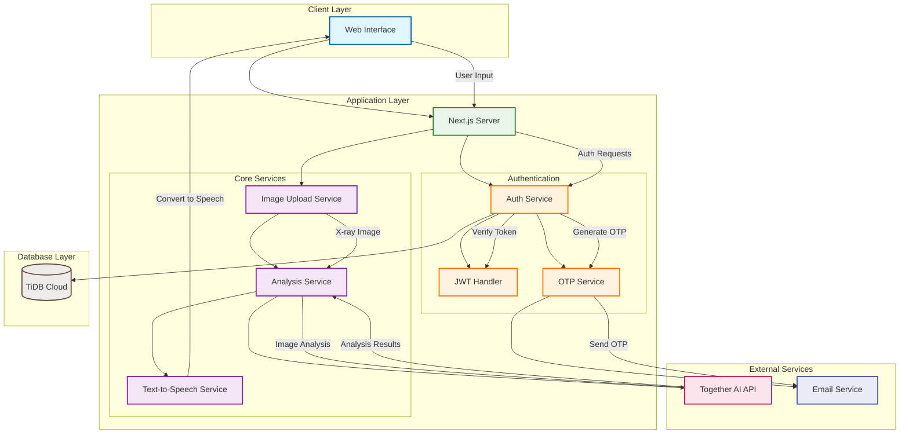

## 🏗️ System Architecture

Below is a detailed architecture diagram of the X-ray Analysis Portal, illustrating how different components interact:

### Architecture Overview

Our system is structured in layers, each with specific responsibilities:

#### 1. Client Layer

- **Web Interface**: Next.js-based frontend providing user interaction
- Features responsive design and real-time updates
- Implements text-to-speech functionality for accessibility

#### 2. Application Layer

The application layer consists of two main components:

**Authentication System**:

- Auth Service: Manages user authentication and session handling
- JWT Handler: Generates and validates JSON Web Tokens
- OTP Service: Handles one-time password generation and verification

**Core Services**:

- Image Upload Service: Manages X-ray image uploads
- Analysis Service: Coordinates with AI for image analysis
- Text-to-Speech Service: Converts analysis results to speech

#### 3. External Services

- **Together AI API**: Powers X-ray analysis using LLAMA 3.2 model
- **Email Service**: Handles OTP delivery

#### 4. Database Layer

- **TiDB Cloud**: At this moment it Stores user data

### Data Flow

1. **Authentication Flow**:

   - User submits credentials through web interface
   - Auth service validates and generates JWT token
   - OTP verification through email when required

2. **Analysis Flow**:

   - User uploads X-ray image
   - Image processed by upload service
   - Analysis service sends to Together AI
   - Results displayed to user

3. **Text-to-Speech Flow**:
   - Analysis results converted to speech on demand
   - Audio playback through web interface

### Security Measures

- JWT-based authentication
- Secure OTP verification
- HTTP-only cookies
- Rate limiting implementation
- XSS protection
- Database encryption

### Performance Features

- Image optimization
- Response caching
- Lazy loading
- Connection pooling
- Query optimization

### Error Handling

- Graceful error recovery
- Automatic retries for API calls
- Comprehensive error logging
- User-friendly error messages

---

Built with ❤️ in Timor-Leste 🇹🇱
