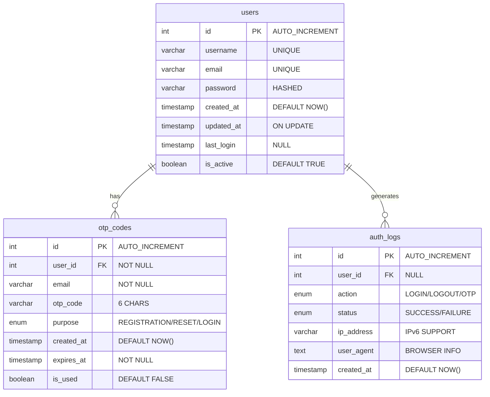

And here's the section explaining the database structure:

## 📊 Database Schema

Our database is structured to ensure secure user authentication and comprehensive activity logging.

### Tables Structure

#### 1. Users Table

Main table storing user information:

```sql
CREATE TABLE users (
    id INT AUTO_INCREMENT PRIMARY KEY,
    username VARCHAR(50) NOT NULL UNIQUE,
    email VARCHAR(100) NOT NULL UNIQUE,
    password VARCHAR(255) NOT NULL,  -- Bcrypt hashed
    created_at TIMESTAMP DEFAULT CURRENT_TIMESTAMP,
    updated_at TIMESTAMP DEFAULT CURRENT_TIMESTAMP ON UPDATE CURRENT_TIMESTAMP,
    last_login TIMESTAMP NULL,
    is_active BOOLEAN DEFAULT TRUE
);
```

#### 2. OTP Codes Table

Manages One-Time Passwords for verification:

```sql
CREATE TABLE otp_codes (
    id INT AUTO_INCREMENT PRIMARY KEY,
    user_id INT NOT NULL,
    email VARCHAR(100) NOT NULL,
    otp_code VARCHAR(6) NOT NULL,
    purpose ENUM('REGISTRATION', 'PASSWORD_RESET', 'LOGIN') NOT NULL,
    created_at TIMESTAMP DEFAULT CURRENT_TIMESTAMP,
    expires_at TIMESTAMP NOT NULL,
    is_used BOOLEAN DEFAULT FALSE,
    FOREIGN KEY (user_id) REFERENCES users(id) ON DELETE CASCADE
);
```

#### 3. Authentication Logs Table

Tracks all authentication-related activities:

```sql
CREATE TABLE auth_logs (
    id INT AUTO_INCREMENT PRIMARY KEY,
    user_id INT,
    action ENUM('LOGIN', 'LOGOUT', 'OTP_REQUEST', 'OTP_VERIFY', 'PASSWORD_RESET') NOT NULL,
    status ENUM('SUCCESS', 'FAILURE') NOT NULL,
    ip_address VARCHAR(45),
    user_agent TEXT,
    created_at TIMESTAMP DEFAULT CURRENT_TIMESTAMP,
    FOREIGN KEY (user_id) REFERENCES users(id) ON DELETE SET NULL
);
```

### Indexes

Performance optimization through strategic indexing:

- `idx_user_email`: Fast email lookups
- `idx_user_username`: Quick username searches
- `idx_otp_expires`: Efficient OTP expiration checks
- `idx_email`: OTP email searches
- `idx_otp_code`: OTP verification lookups

### Relationships

- Users → OTP Codes: One-to-Many (1:N)
- Users → Auth Logs: One-to-Many (1:N)

### Security Features

- Password hashing with bcrypt
- OTP expiration management
- Activity logging with IP tracking
- Soft delete support
- User status tracking

### Data Integrity

- Foreign key constraints
- Unique constraints
- Automatic timestamps
- Status tracking
- Activity logging

---

Built with ❤️ in Timor-Leste 🇹🇱
